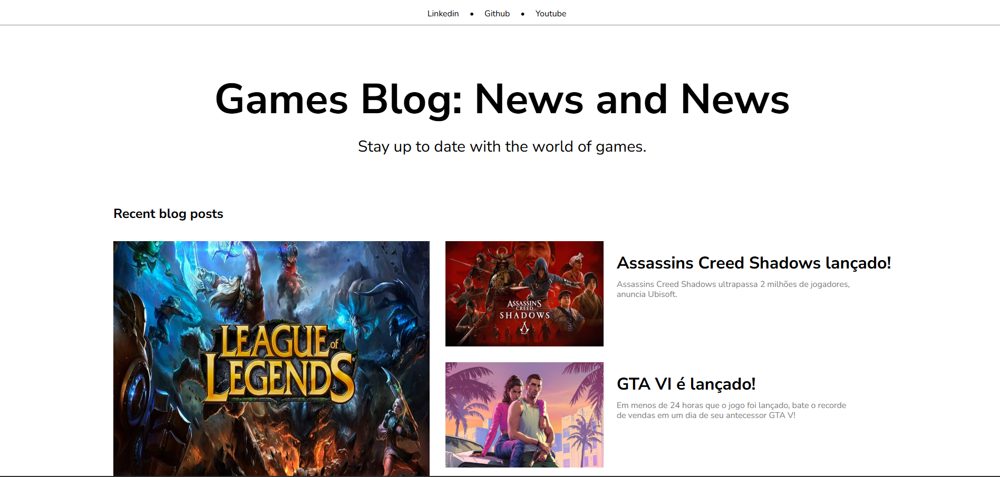
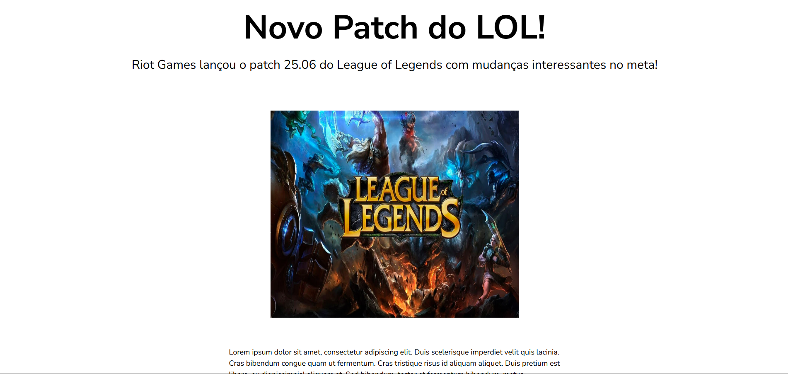

<h1 align="center" style="font-weight: bold;">Angular blog 💻</h1>

<p align="center">
 <a href="#technologies">Technologies</a> • 
 <a href="#started">Getting Started</a> • 
</p>

<p align="center">
    <b>Projeto de blog sobre games com base em templates do Dribbble.</b>
</p>

<h2 id="layout">🎨 Layout</h2>

<p align="center">
    
    
</p>

<h2 id="technologies">💻 Technologies</h2>

- Angular
- Typescript
- HTML
- CSS

<h2 id="started">🚀 Getting started</h2>

<h3>Prerequisites</h3>

- [NodeJS](https://nodejs.org/en/download)

<h3>Cloning</h3>

```bash
git clone https://github.com/henrique0120/angular-blog
```
<h3>Starting</h3> 

```bash
npm install
cd angular-blog
ng s -o
```
